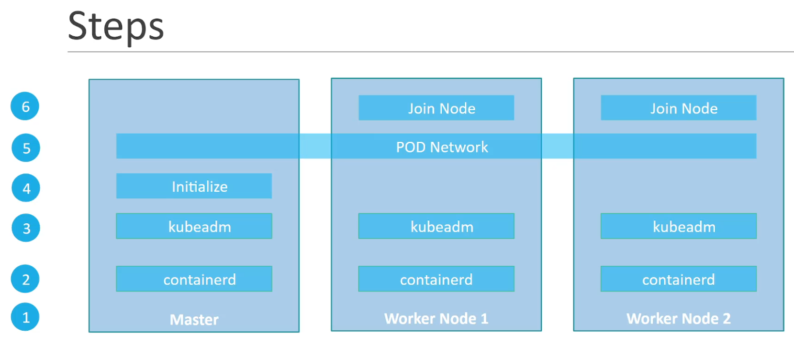

# Kube basics

1. [Components](./components.md)
2. [Resources](./resources.md)
3. [Scheduling](./scheduling.md)
4. [Practices](./practices.md)
5. [Cheatsheet](./cheatsheet.md)
6. [Maintenance](./maintenance.md)
7. [Security](./security.md)
8. [Troubleshoot](./troubleshoot.md)
9. [Storage](./storage.md)
10. [Networking](./networking.md)

## installation

* kubeadm pour du on-prem
* GKE pour GCP
* Kops pour AWS
* AKS pour Azure

en production, la bonne pratique c'est de taint le master node de maniere à ne deployer aucun workload pod dessus

Sur windows il n'existe pas de binaire kube donc il faut passer par une VM linux.

minikube = single node only

## HA dans kube

Si le master node tombe, les pods sur les worker nodes continuent de tourner mais si le pod tombe alors que la master node est toujours indispo alors personne ne relancera le pod. On peut choisir de dédoubler le master node pour de la HA (high availability).

Si on duplique le master node il faut savoir que kube s'attend à ce qu'on élise l'un des 2 leader qui sera dans un etat actif alors que le 2e sera en standby via l'option `--leader-elect <bool>` de la commande kube-controller-manager et du scheduler. Sous la capot ca fonctionne avec un lock mecanisme et un "control loop" schedulé (configurable via les options `--leader-elect-*`)

## HA avec etcd

ETCD est une db clé-valeur distribuée et consistente, donc il est fait pour faire de la HA. Lorsqu'une écriture est fait, les serveurs vont élir un leader qui aura le role d'écrire dans son datastore puis de s'assurer que l'écriture est repliqué dans les autres serveurs. ETCD considère qu'une écriture (transaction) est finie que lorsque le leader s'est assuré que l'écriture a été repliquée dans la majorité (i.e. quorum = N/2 + 1) des nodes. C'est pour cette raison qu'on recommande d'avoir au moins 3 nodes pour faire du HA avec ETCD et un nombre impair. Le meilleur c'est 5. À noter qu'il nous faut autant de master node kube que de serveurs ETCD.

Le leader est élue selon le protocol RAFT. en gros c'est de la concurrency : tous les nodes vont demander tous ensemble d'être le leader et c'est le premier à recevoir les accords de tous les autres qui le devient

## Installation avec kubeadm

En gros on doit suivre ces étapes :

Grosso modo il faut suivre la doc [kubeadm install](https://kubernetes.io/docs/setup/production-environment/tools/kubeadm/install-kubeadm/)

Rq à l'install du runtime container :
Faire attention aux [drivers cgroup](https://kubernetes.io/docs/setup/production-environment/container-runtimes/#cgroup-drivers) qui dépendent du process pid 1 de notre OS : si `pid 1 = systemd` alors il faut les drivers cgroup `systemd`, sinon `cgroupfs`. Lancer la commande `ps -p 1` pour savoir.

Rq à l'init de kubeadm :
* differencier si on est en HA ou pas cad si on a plusieurs master nodes ou pas
* on peut spécifier l'ip atribué à l'interface utilisé dans le network du cluster via l'option `--apiserver-advertise-address=<ip-address>`
* on lance l'init avec `sudo`

### Tips CKA

Pour tester que l'install est bonne, tenter de deployer un pod e.g. nginx
