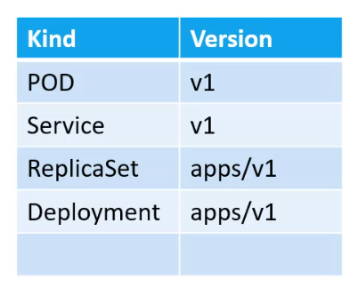

# Cheatsheets

## InitContainers

* si on veut run un truc avant le lancement du/des container(s) d'un pod, on peut utiliser initContainers qui est une liste de command. La liste s'execute séquentiellement et kube attend qu'elles soient toutes terminées avec succès pour lancer le(s) container

## YAML definitions files

4 clés sont à la racine : 
* `apiVersion`, `kind` >> ces 2 là sont assez vite vus car il y a pas 300 solutions (cf. screen) 



* `metadata` >> où l'on peut annoter des choses concernant le pod, notamment la clé `labels` qui permet en général de distinguer les pods sur le cluster (le choix des clés est libre pour tout ce qui se trouve dans les labels)
* `spec` >> c'est là que tout va se jouer. À noter que les clés possibles dans cette partie sont différentes selon ce qu'on a choisi de déployer i.e. ce qu'on a mis dans `apiVersion`, `kind`
  * `containers` est une liste car on peut avoir plusieurs containers dans un pod. C'est ici qu'on va renseigner l'image docker sur le registry docker hub (on peut utiliser un autre regitry bien sûr, dans ce cas il faut mettre l'url en entier)

## CLI commands

* pour créer un pod dont le conteneur expose le port 8080
```sh
kubectl run pod-name -i <image-name> --port=8080
```

* pour créer un pod dont le conteneur expose le port 8080 ET EN PLUS est exposé via un service clusterIP
```sh
kubectl run pod-name -i <image-name> --port=8080 --expose
```

* Pour appliquer un _def file_
```sh
kubectl create -f <path-to-yaml>
```
ou
```sh
kubectl apply -f <path-to-yaml>
```
qui fonctionne tout le temps i.e. pour la creation ou l'édition
ou
```sh
# wildcards pour filtrer
k apply -f '<prefix>*.yaml'
```

* pour générer un def file facilement
```sh
kubectl run redis --image=redis123 --dry-run=client -o yaml > redis-pod.yaml
```

* pour generer un conf file de type Deployment p ex 
```sh
kubectl create deployment <name> --image=<image> --replicas=<number> --dry-run=client -o yaml > deployment-auto-gen.yaml
```

* si on est ssh sur le master node, on peut toujours se ssh sur un worker node via l'ip interne de kube i.e. celle qui commence par `10.*`

* pour modifier les valeurs d'un context pré-existant (p ex le namespace)
`kubectl config set-context $(kubectl config current-context) --namespace=default`

* rollout commands pour avoir des infos sur les revisions ou bien pour **rollback**

```sh
kubectl rollout status deployment/myapp-deployment
kubectl rollout history deployment/myapp-deployment # pour lister les revisions d'une ressource
kubectl rollout undo ... # pour rollback
```

* pour "vider" un node worker (avant un opé de maintenance p ex) cad bouger les pods existants dans les autres nodes disponibles
```sh
# vide le node
kubectl drain <node-name>
# re-remplir le node
kubectl uncordon <node-name>
# pour bloquer le scheduling de nouvelles ressources sur un node
kubectl cordon <node-name>
```

* pour afficher le contenu d'un certif openssl, on utilise la commande 
```sh 
openssl x509 -in <path du certif> -text -noout
```
Les infos les plus courantes sont : `Subject`, `Subject Alternative Name`, `Issuer` et `Validity`


* charger la config `kubeconfig` dans curl directement (si on veut parler à l'api http de kube directement)
```sh
k proxy # pour lancer un proxy local qui utilisera la conf kubeconfig sans avoir à passer --cert --key -- cacert tout le temps dans curl\
```

* pour créer un serviceaccount
```sh
k create serviceaccount <name>
```

* pour lister les PV d'un cluster
```sh
k get peristentvolumes
```


### Backup and restore

* procédure backup-restore avec etcd
```sh
ETCDCTL_API=3 etcdctl snapshot save snapshot.db --cert= --key= --cacert= --endpoints=
ETCDCTL_API=3 etcdctl snapshot restore snapshot.db --data-dir /var/lib/etcd-from-backup --cert= --key= --cacert= --endpoints=
# puis relancer le pod (/etc/kubernetes/manifests/etcd.yaml) ou le service (/etc/systemd/system/etcd.service ou systemctl status etcd pour récupérer le path pour l'editer puis service etcd restart)
```

* pour créer un token jwt pour un SA
```sh
kubectl create token <sa-name>
```

* pour monter automatique le token d'un SA à un pod, utiliser `serviceAccountName: <sa-name>`
```yaml
apiVersion: v1
kind: Pod
metadata:
  name: nginx
spec:
  containers:
  - image: nginx
    name: nginx
    volumeMounts:
    - mountPath: /var/run/secrets/tokens
      name: vault-token
  serviceAccountName: build-robot
  volumes:
  - name: vault-token
    projected:
      sources:
      - serviceAccountToken:
          path: vault-token
          expirationSeconds: 7200
          audience: vault
```

### debug networking

* pour trouver les infos de l'interface bridge que 
```sh
ip addr show type bridge
```

* pour retrouver l'interface network d'un node
```sh
#1 retrouver l'ip interne attribuée à notre node
k get nodes -o wide
#2 grep cette IP dans la liste des interfaces réseaux
ip a | grep -B3 <l'addr ip>
```

* pour retrouver les ports qu'écoutent les différents pods des core components
```sh
netstat -nlpt
# netstat -npt si on cherche à voir le nombre de connection d'une service
```

* pour retrouver les noms et les raccourcis (ainsi que l'API Group associé) :
```sh
kubectl api-resources
```

* pour compter toutes les ressources (pod, rs, deploy, svc)
```sh
k get all -l <labels or selectors> --no-headers | wc -l
```

* pour créer un daemonset, on peut partir du conf file d'un deployment et remplacer Deployment par DaemonSet (il faudra supprimer replicas & strategy)

* Kube ajoute automatiquement le nom du node à la suite pour nommer un static pod. On peut se servir de ca pour reconnaitre les static pods des autres via la reponse de la commande `kubectl get po`

* k offre quasi-nativemnent du monitoring/logs
```sh
$ k top -h
Display Resource (CPU/Memory) usage.

 The top command allows you to see the resource consumption for nodes or pods.

 This command requires Metrics Server to be correctly configured and working on the server.

Available Commands:
  node          Display resource (CPU/memory) usage of nodes
  pod           Display resource (CPU/memory) usage of pods
```

* pour retrouver le detail d'un process qui tourne sur un host
```sh
systemctl list-unit-files
syetemctl status <unit-files> -l --no-pager
```

* pour retrouver les conf CNI d'un cluster kube
```sh
# Par def c'est dans `/opt/cni/bin/` qu'on retrouve les plugins/binaires disponibles
ls /opt/cni/bin/

# Pour retrouver le plugin cni utilisé
ls /etc/cni/net.d/
```

* use the ipcalc tool to see the network details:
```sh
root@controlplane:~> ipcalc -b 10.33.39.8
Address:   10.33.39.8           
Netmask:   255.255.255.0 = 24   
Wildcard:  0.0.0.255            
=>
Network:   10.33.39.0/24        
HostMin:   10.33.39.1           
HostMax:   10.33.39.254         
Broadcast: 10.33.39.255         
Hosts/Net: 254                   Class A, Private Internet
```

kube-dns est le service qui permet de faire la résolution dns dans le sluster (notamment au niveau de chaque pod c'est donc son ip qui apparaitra dans /etc/resolv.conf)

* pour tester la conf de sécurité sur le component api-servcer (les objets RBAC p ex), on peut utiliser l'option --as (il faut ajouter les creds du user dans le kubeconfig au préalable)
```sh
k <command> --as <username>
```

* un couple de manifests PV PVC sur le host
```yaml

```