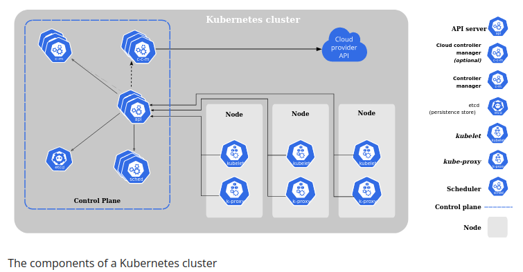

-------------------------
-------------------------
# Kubernetes components

Tous ces services sont des pods visibles dans le namespace `kube-system`...

  ...lorsque kube est installé via l'outil `kubeadm` et leur config est visible dans les fichiers `/etc/kubernetes/manifests/*`. 
  Sinon, on peut aussi télécharger les binaires compilés (vu que c'est du Go :p) et les lancer en tant que services (sans oublier de passer toutes les options genre les IPs etc). Dans ce cas la config est dans `/etc/systemd/system/kube-*.service`

En résumé on a 2 categories :
1. control plane components
2. node components

## 1. Control Plane components

### Controller manager

> Il surveille les nodes, les pods ou les container et les compare avec l'état désiré. Il surveille également leurs status (~healthchecks) et corrige s'il y a un écart.

La logique de ce service est split en plusieurs partie : 
* node-controller
* replication-controller
* etc

Mais ils sont tous regrouper dans un unique binaire/service process `kube-controller-manager`

Le pattern utilisé est le "`control loop`" d'où son nom : il surveille l'état du cluster à intervalle régulier (configurable) et applique (ou demande) des modifs lorsque nécessaire.

### Scheduler

> Il assigne un pod à un node. 

Il ne va pas vraiment créer les Pods (c'est Kubelet qui s'en charge)
Il détermine un ranking de chaque node pour déterminer le meilleur pour le pod.

Le scheduler est un objet qui  va regarder les requirements pour le pod. À partir de là il va d'abord exclure les nodes qui ne correspondent pas du tout (ex CPU insuffisant). Ensuite il va scorer/rank chaque node pour déterminer le meilleur. 

Ensuite ça devient technique car il faut savoir qu'une fois qu'un pod existe, kube n'autorise plus l'édition de la clé `nodeName`. Ce que fait kube-scehduler c'est qu'il va créé un objet `Binding` avec le node choisi en target via une POST request sur `/pods/$PODNAME/binding` avec le def file `kind: Binding` JSONifié

  
À noter que le Scheduler peut etre completement configurer/overrider

  Il est possible de créer des scheduler custom. Kube prévoit d'ailleurs que plusieurs scheduler peuvent tourner en meme temps. Attention, il faut toutefois les configurer d'une certaine maniere en definissant un leader (relire la doc à ce sujet peut etre)

  Il faut savoir que le scheduler par defaut tourne comme un (static) pod (au meme titre que la plupart des services kube). On peut récupérer le manifest yaml du scheduler par defaut. On voit qu'il pull l'image binaire compilé et lance la commande kube-scehduler dans le conteneur comme n'importe quel autre commande. On peut donc faire pareil mais on n'est pas obligé de le faire via un pod static. On spécifie ensuite le scheduler qu'on veut via un conf file qu'on veut schedulé (clé `spec.schedulerName`).

On peut débug le(s) scheduler(s) via les events `kubectl get events`. On peut aussi voir tous les logs d'un scheduler via la commande `kubectl logs <scheduler_name>`

### Kube-APIserver

> Sorte d'api gateway pour les composants Kube.

Son role c'est d'authentifier l'auteur d'une requete, de valider la requete, de retrouver la data et de formatter une reponse.

C'est l'API qui est interrogée pour tout : 
* si tu veux interroger ETCD cluster, ca va passer par lui (d'ailleurs il est le seul à l'interroger directement)

C'est une vraie API, dans le sens où l'on peut l'interroger via des requete HTTP directement

### ETCD

> Une db clé-valeur qui contaient les données du cluster : son état et sa configuration

  
...

  Etcd is fault tolerant (consistent) and distributed.

### Cloud-Controller-Manager (optionnel)

> Composant qui embarque toute la logique spécifique au cloud provider

De la meme maniere que le controller manager, son role est splitée mais on l'a regroupe dans un unique service process.

Les contrôleurs suivants peuvent avoir des dépendances de fournisseur de cloud :
* node controller : pour vérifier le cloud provider afin de déterminer si un node a été supprimé dans le cloud après qu'il ait cessé de répondre
* Route controller : pour configurer des routes dans l'infrastructure cloud sous-jacente
* Contrôleur de service : pour créer, mettre à jour et supprimer les LB du cloud provider

## 2. Node worker components

### Kubelet

> Capitaine d'un worker node

Il gère les opérations sur son node : p ex il est capable de créer des PODs sauf que ce n'est pas lui qui sait lesquels doivent etre créé. En fait pour ca il interroge le master node (via apiserver). C'est lui qui lance le container runtime. C'est lui aussi qui execute les commandes "réseau" du CNI

  
Static PODs

  Pour créer des PODs, kubelet a besoin d'un configuration file. Pour les avoir, en general il demande à l'apiserver. 
  Il est toutefois possible de conf kubelet pour qu'il cherche les def file des PODs ailleurs e.g. dans un autre datastore, p ex un directory sur le node directement. Si les conf files sont présents alors il créera les PODs et les maintiendra en vie. C'est ce qu'on appelle des **static PODs**. 
  Pour le configurer, on passe le path du directory en option au lancement du service kubelet. On peut aussi passer une conf YAML plus globale en option avec le path des statics pods dedans. À noter que Kube apiserver a connaissance de ces PODs bien qu'il ne gère pas leur création. C'est parce que kubelet crée un miroir de ses static pods. ainsi `kubectl get po` retourne bien les infos. En revanche on ne peut pas utiliser les commandes edit ou delete p ex. Pour ca il faut editer les manifests yaml directement sur le node.
  À savoir que kubelet ne connait pas d'autre type d'obj que les PODs. 
  C'est comme ca que sont créés les PODs nécessaires au fonction interne de kubernetes, que ce soit sur le master node ou les autres. 
  RQ: Kube ajoute automatiquement le nom du node à la suite pour nommer un static pod. On peut se servir de ca pour reconnaitre les static pods des autres via la reponse de la commande `kubectl get po`

### Kube-proxy

> C'est le moyen utilisé par les pods pour "se parler".

Il s'agit d'un service pour exposer les IPs des différents pods car celles-ci peuvent changer. Il s'agit d'un proxy car en fait l'IP est exposée pointe vers le service reseau "pod network". Ce service va alors fwd la requete vers le bon pod.
Contrairement à d'habitude, pour une install via `kubeadm` ce service est un **DeamonSet** sur chaque node worker. Il peut par ex s'appuyer sur une conf _IP table_. Dans ce cas il va créer des règles ipTable sur chaque node worker du cluster pour FWD suir la bonne IP

## Exemple de la création d'un pod

1. `APIserver` va créer un pod sans lui assigner de node, puis il update le `ETCD cluster`(/store)
2. `Scheduler`, qui interroge régulièrement kube-apiserver, va alors découvrir un pod sans node. Il va choisir un node et demander à l'apiserver d'update `ETCD cluster` et de passer l'info au kubelet du node worker en question
3. `Kubelet` va créer le pod sur son node et execute le container runtime engine (aka Docker) pour déployer l'image dessus. Une fois que c'est fini, Kubelet va demander à apiserver de mettre à jour le status du pod dans le `ETCD cluster`
