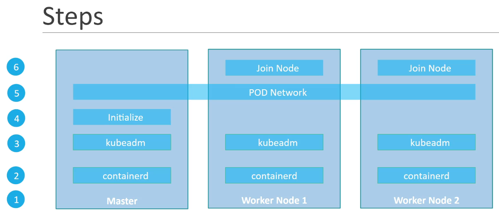

# Maintenance & installation

## Cluster upgrade

* k8s ne supporte que 3 mineures versions en parallele.
* il est reco d'upgrade mineure par mineure
* On tolère certaines diff de version entre les composants (cf. screen)


Si on veut upgrade, en gros on procéder en 2 étapes :
* on commence par upgrade le master node car le reste peut tourner plutot bien le temps où le master node est down. Lorsque le master node est à nouveau dispo, tout devrait refonctionner normalement.
* on upgrade ensuite les worker nodes un par un ou bien ajouter des worker nodes dans la bonne version directement avant de supprimer les anciens nodes

Note : `cat /etc/*release*` pour connaitre l'OS et sa version sur le master node et ainsi appliquer la bonne [documentation k8s pour upgrade un cluster](https://kubernetes.io/docs/tasks/administer-cluster/kubeadm/upgrading-linux-nodes/)

<details>

Plus précisément, si on a kubeadm on peut suivre ces étapes. 
Sur le master node :
* `kubeadm upgrade plan` pour voir les infos d'upgrade possible.
* install la bonne version de `kubeadm` via `apt` 
  * `apt-get upgrade -y kubeadm=1.xx.x-xx`
* lancer `kubeadm upgrade apply v1.xx.x`
* il faut ensuite updgrade les kubelets de chaque node (dont le master)
  * `apt-get upgrade -y kubelet=1.xx.x-xx`
  * `systemctl restart kubelet`

Sur les worker nodes la manip est similaire à qqs details près :
* on drain le node via la master `kubectl drain node-a`
* puis sur le node, on run
  * `apt-get upgrade -y kubeadm=...`
  * `apt-get upgrade -y kubelet=...`
  * `kubeadm upgrade node config --kubelet-version v1.xx.x`
  * `systemctl restart kubelet`
* enfin on "décordonne" le node via la master `kubectl uncordon node-a`

Rq : Pour savoir quelle version choisir pour l'upgrade :
```sh
apt update
apt-cache madison kubeadm
```
sachant que pour etre sûr de savoir quelle distrib est installée sur nos host faire un `cat /etc/*release*`

Quand on install les packages kube (kubeadm, kubelet, kubectl), en general on pin leur version via la commande `sudo apt-mark hold kubelet kubeadm kubectl`

</details>

## Backup et restore de cluster

Premièrement la bonne pratique c'est de tout faire en declaratif et non en imperatif (approche gitops)

Sinon, pour sauvegarder la conf kube comme backup en passant par kube-apiserver :
`kubectl get all --all-namespaces -o yaml > all-deploy-services.yaml`
Mais il existe des outils qui permettent de l'automatiser directement comme velerio (ex ark by heptio)

Enfin, un bon moyen de backup son cluster c'est d'utiliser les features de backup/restore de ETCD vu que toute la conf du cluster kube est dedans :

1. `ETCDCTL_API=3 etcdctl snapshot save snapshot.db` en complétant avec les options --endpoints --cacert --cert et --key que l'on retrouve dans la description du pod etcd
2. `service kupe-apiserver stop` (à vérifier)
3. `ETCDCTL_API=3 etcdctl snapshot restore snapshot.db --data-dir /var/lib/etcd-from-backup` (à noter que l'on doit créer une nouvelle _location_ à chaque fois car sous le capot etcd initialise un nouveau cluster sinon des éléments pourraient se mélanger)
4. il faut ensuite edit le pod etcd pour utiliser la nouvelle location sans oublier de modifier le directory de montage du volume etcd-data. Pour ca on peut editer le yaml `/etc./kubernetes/manifests/etcd.yaml`, vu qu'il s'agit d'un static pod kube-system (il faudra relancer les binaires si k8s n'a pas été installé via kubeadm)
5. `systemctl daemon-reload && service etcd restart && service kube-apiservice start`

## Installation

* kubeadm pour du on-prem
* GKE pour GCP
* Kops pour AWS
* AKS pour Azure

en production, la bonne pratique c'est de taint le master node de maniere à ne deployer aucun workload pod dessus

Sur windows il n'existe pas de binaire kube donc il faut passer par une VM linux.

minikube = single node only

## HA dans kube

Si le master node tombe, les pods sur les worker nodes continuent de tourner mais si le pod tombe alors que la master node est toujours indispo alors personne ne relancera le pod. On peut choisir de dédoubler le master node pour de la HA (high availability).

Si on duplique le master node il faut savoir que kube s'attend à ce qu'on élise l'un des 2 leader qui sera dans un etat actif alors que le 2e sera en standby via l'option `--leader-elect <bool>` de la commande kube-controller-manager et du scheduler. Sous la capot ca fonctionne avec un lock mecanisme et un "control loop" schedulé (configurable via les options `--leader-elect-*`)

## HA avec etcd

ETCD est une db clé-valeur distribuée et consistente, donc il est fait pour faire de la HA. Lorsqu'une écriture est fait, les serveurs vont élir un leader qui aura le role d'écrire dans son datastore puis de s'assurer que l'écriture est repliqué dans les autres serveurs. ETCD considère qu'une écriture (transaction) est finie que lorsque le leader s'est assuré que l'écriture a été repliquée dans la majorité (i.e. quorum = N/2 + 1) des nodes. C'est pour cette raison qu'on recommande d'avoir au moins 3 nodes pour faire du HA avec ETCD et un nombre impair. Le meilleur c'est 5. À noter qu'il nous faut autant de master node kube que de serveurs ETCD.

Le leader est élue selon le protocol RAFT. en gros c'est de la concurrency : tous les nodes vont demander tous ensemble d'être le leader et c'est le premier à recevoir les accords de tous les autres qui le devient

## Installation avec kubeadm

En gros on doit suivre ces étapes :



Grosso modo il faut suivre la doc [kubeadm install](https://kubernetes.io/docs/setup/production-environment/tools/kubeadm/install-kubeadm/)

Rq à l'install du runtime container :
Faire attention aux [drivers cgroup](https://kubernetes.io/docs/setup/production-environment/container-runtimes/#cgroup-drivers) qui dépendent du process pid 1 de notre OS : si `pid 1 = systemd` alors il faut les drivers cgroup `systemd`, sinon `cgroupfs`. Lancer la commande `ps -p 1` pour savoir.

Rq à l'init de kubeadm :
* differencier si on est en HA ou pas cad si on a plusieurs master nodes ou pas
* on peut spécifier l'ip atribué à l'interface utilisé dans le network du cluster via l'option `--apiserver-advertise-address=<ip-address>`
* on lance l'init avec `sudo`

### Tips CKA

Pour tester que l'install est bonne, tenter de deployer un pod e.g. nginx
