# Networking

## Pré-requis

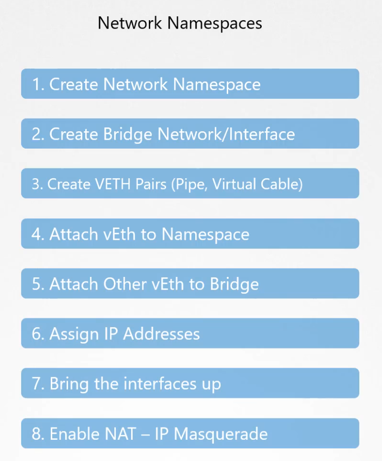

* `ip link` permet de voir les interfaces de networking (physique ou virtuelle) dispo sur un host.
* `ip addr` permet de voir les IPs attribuées sur ces interfaces
* `ip address show <filters>` pour afficher des infos filtrées qui peut s'avérer très utile dans certains cas p ex  `ip address show type bridge` pour afficher les ifaces de type bridge

### Switch (commutateur)

`Permet de connecter 2 PCs ou plus pour qu'ils puissent se joindre`

Pour recevoir des paquets :
1. On co le switch à une interface
2. On attribue une adresse IP à l'interface utilisée via `ip addr add <ip> dev <interface name>`

Si on fait ça sur 2 hosts connecté au meme switch, les hosts peuvent se ping mutuellement. **Cette config constitue ce qui s'appelle un network**. 


### Router

On utilise un router pour connecter plusieurs networks. Le router appartient à chaque network qu'il connecte (i.e. il possède une IP sur chaque network). 

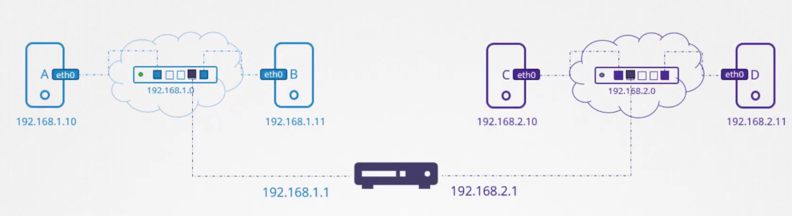

#### Differences entre switch et router
* le switch connecte des appareils finaux entre eux, le router connecte des réseaux entre eux
* dans un network (géré par un switch), "tout le monde se connait" = chaque appareil se parle directement
* Un commutateur fonctionne sur la data link layer du modèle OSI ; d'autre part, un routeur fonctionne sur la couche réseau du modèle OSI
* Le router est une machine intelligente (contrairement au switch)


#### Gateway
Quand 2 networks sont co par un router, les devices de chaque network considèrent le router comme un intermédiaire pour s'adresser à d'autres networks : il faut config une route ( = gateway) sur chaque appareil pour déclarer le router nécessaire pour s'adresser à tel ou tel network

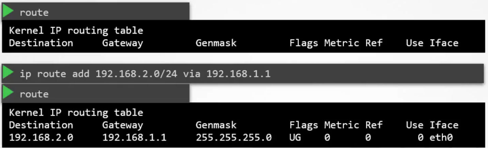

Pour ne pas se taper la conf des routes pour toutes les IPs du monde d'internet, on peut enfin config un lien vers le reste des IPs via la config `ip route add default <ip du router connecté à internet>` ou bien `ip route add 0.0.0.0 <ip du router connecté à internet>`

<details><summary>Transformer un host/appareil du réseau en router</summary>

N'importe quel host peut faire office de router. Ceci dit, une option peut coincer. Par defaut, sous linux, pour des raisons de sécurité, un host ne forward pas les paquets sur une IP connue. Autrement dit, si un host A essaie de parler à un host C par l'intermediaire d'un host B, il faudra :
1. ajouter une entrée dans la table de routing de A pour déclarer B
2. idem dans C pour ajouter B
3. activer l'option `ip_forward` sur B dans le fichier `/proc/sys/net/ipv4/ip_forward`
</details>

### DNS

Dans le passé, on gérait la résolution sur chaque host via le fichier /etc/hosts. Depuis on centralise la resolution dans un serveur DNS.

Coté host, on déclare un serveur DNS dans `/etc/resolv.conf`
On peut ensuite gérer la priorité dans `/etc/nsswitch` (par def linux regarde d'abord en local et s'il ne trouve pas alors il va demande au serveur DNS)

8.8.8.8 est un serveur de nom de domain hébergé par google

.com .io .org = top level domain
google = domain
www = subdomain

<details><summary>Exemple de resolution apps.google.com</summary>

D'abord on essaie de resoudre l'ip depuis le serveur dns interne. S'il ne sait pas, il fwd la requete sur internet :
1. un serveur dns `root` fwd d'abord la requete sur un serveur dns `.com`
2. `.com` fwd sur un serveur dns google
3. enfin, notre serveur dns interne pourrait mettre l'ip en cache
</details>

<details><summary>Search domain option</summary>

On peut ajouter une entrée de type "search" dans notre `/etc/resolv.conf` auquel cas il essaiera d'ajouter le nom de domain spécifié dans l'entrée pour des rechercher. P ex si on ajoute l'entrée `search mycompany.com puis qu'on cherche à joindre `web` alors il essaiera de joindre `web.mycompany.com`
</details>

Les entrées qu'on stocke dans un serveur DNS s'appellent des *record types* :
* `A`     record map une ipv4 avec un nom de domaine
* `AAAA`  record map ipv6
* `CNAME` map un nom de domaine avec un ou plusieurs noms de domain

La commande `nslookup` permet de debug la resolution DNS (mais attention il ne va pas essayer de regarder `/etc/hosts`). idem pour la command `dig`

### Namespace

Dans le networking aussi il existe une notion de namespace sous linux. C'est aussi un mécanisme d'isolation logicielle.

Lorsqu'un conteneur est créé, kube crée pour lui un network namespace. Autrement dit, le conteneur a sa propre interface réseau, ainsi que sa propre route table et ARP table.

On peut créer un namespace avec la commande `ip netns add <nom du namespace>`
* `ip link -n <nom du namespace>` permet de lister les interfaces dans un namespace
* `ip netns exec <nom du namespace> <command à executer>` permet d'executer une command dans un namespace
* ainsi `ip netns exec <nom du namespace> arp` et `ip netns exec <nom du namespace> route` nous permette de voir que le namespace réseau isole bien les tables du host.

Un namespace peut être vu comme un appareil (ordi)

<details><summary>Connection entre namespaces</summary>

On peut ensuite connecter des namespaces un peu comme avec un cable virtuel. P ex si on a créé auparavant 2 namespace réseau "one" et "two" on peut alors les relier :
```sh
ip link add veth-one type veth peer name veth-two # pour créer le cable virtuel
ip link set veth-one netns one # pour branche "one"
ip link set veth-two netns two # pour brancher "two"
ip -n one addr add <ip one> dev one # pour attribuer une ip sur l'interface de one
ip -n two addr add <ip two> dev two # pour attribuer une ip sur l'interface de two
ip -n one link set veth-one up # pour activer la connection dans one
ip -n two link set veth-two up # pour activer la connection dans two
ip netns exec one ping <ip two> # pour vérifier que la co fonctionne
```
C'est compliqué et en plus on n'est meme pas encore capable de faire aussi bien qu'un switch

Detail important : le host ne voit pas les IPs que l'on a attribuées sur les interfaces de chaque namespace
</details>

Le host ne voit pas les éléments créés au sein de chaque namespace

#### Virtual network

Pour co plusieurs namespaces entre eux via un switch virtuel. LinuxBridge (et Open vSwitch) sont des solutions open source pour ça. Pour ca on lance la command `ip link add v-net-0 type bridge` pour créer une nouvelle interface (virtuelle cette fois ci). Ensuite on la connecte avec des cables virtuels (`type veth peer`) aux interfaces des namespaces (on crée d'abord le "cable", ensuite on peut allouer une IP comme on l'avait fait pour un vrai switch). **À ce niveau, les namespaces peuvent déjà se ping mutuellement**.

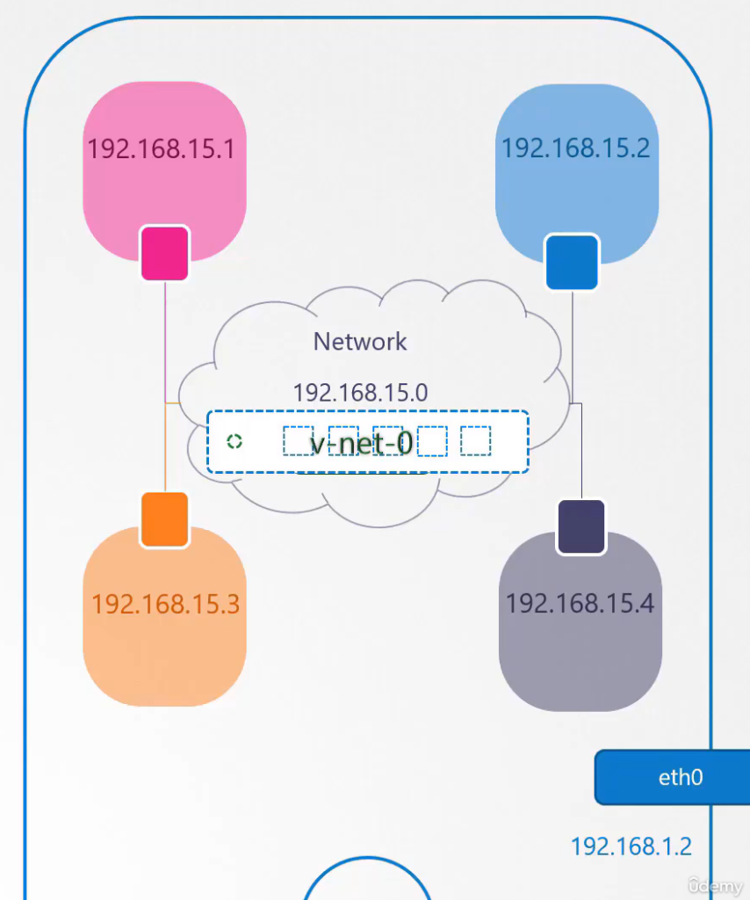

Si on ajoute une IP range à l'interface de type bridge que l'on a créée précédemment sur le host, ce dernier peut alors joindre tous les namespaces co au "switch virtuel" : `ip addr add <ip host que l'on souhaite>/24 dev v-net-0`. C'est comme si on avait un switch avec le host co dessus ainsi que chaque namespace. **On vient de créer un private virtual network**.

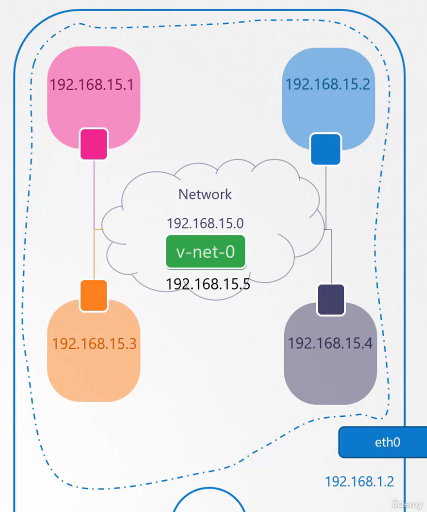

Pour l'instant les namespaces ne peuvent pas dialoguer en dehors du réseau établi par le switch (virtuel). Vu que le host est co à internet (ou à d'autres réseau), celui ci peut faire office de router :
* pour chaque namespace, on peut ajouter une route(/gateway/door) `ip netns exec one ip rout add <addresses du réseau co au host> via <ip du host attribuée à l'interface du bridge>`
* pour que le destinataire sache à qui répondre (i.e. le host et non pas un namespace dont il n'a pas connaissance), il faut aussi activer la feature NAT au niveau du host. Celle-ci remplace l'IP du namespace dans les headers des paquets par celle du host. `iptables -t nat -A POSTROUTING -s 192.168.15.0/24 -j MASQUERADE`
* on peut faire pareil pour accéder à internet `ip netns exec one ip rout add default via 192.168.15.5`

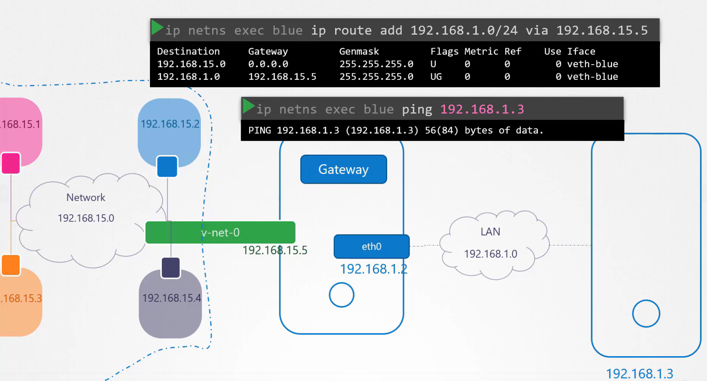

Pour que les namespaces soient joignables, on active le port forwarding (comme sur un router) grace à iptable une fois de plus. En gros on va config le host pour qu'il route tous les paquets qu'il reçoit sur un port donnée (e.g. port 80) vers l'ip du bon namespace. `iptables -t nat -A PREROUTING --dport 80 --to-destination <ip du bon namespace>:80 -j DNAT`

### DockerNetwork

* None = isolation complete du container (il n'est pas joignable et ne peut joindre personne)
* Host = le conteneur partage tout avec le host mais du coup si 2 conteneurs essaient d'écouter sur le meme port alors ca casse
* Bridge = c'est un network privée avec l'ip 172.17.0.0 par defaut. Il utilise en grande partie les memes composants que l'on a étudié ce dessus. Chaque nouveau conteneur se voit assigner un nouveau namespace 

Docker crée un network privée de type bridge qui s'appelle docker0 sur le host

#### Bridge

C'est un software connu qui permet de gérer le network de container. Il implémente la CNI (comme la plupart des softwares sur le marché). On parle de plugin.

Docker n'implémente pas CNI (il utilise son propre standard : CNM - Container Network Model). Ainsi, on ne peut pas lancer un conteneur avec le runtime docker en spécifiant un plugin CNI à utiliser. Par contre on peut lancer le conteneur sans network (option `none`) puis on utilise un plugin (p ex Bridge) pour brancher le network. C'est comme ça que fait kubernetes.

### Cluster Networking

Un cluster kube utilise un network pour fonctionner : chaque node doit etre connecté à ce network ce qui veut dire qu'il doit avoir une interface connecté sur ce network et avoir une IP sur cette interface (comme on l'a vu précédemment). 

<details>À noter que chaque node doit également avoir un hostname unique sur le réseau et une MAC addr unique</details>

Les différents services (kube-apiserver, kubelet, kube-scheduler. kube-controller-manager, etc) nécessitent chacun l'ouverture d'un port sur le node sur lequel ils tournent. Le mieux c'est de consulter la [doc](https://kubernetes.io/docs/reference/networking/ports-and-protocols/)

À noter que kube ne propose pas de solution built-in pour le networking, c'est à l'installation qu'on doit choisir et implem une solution en fonction des besoins et des limites ([liste des Addons](https://kubernetes.io/docs/concepts/cluster-administration/addons/)). 

Kube nécessite par ailleurs qu'un certain nombre de règles soient respectées concernant le networking pour les pods :
* tous les pods doivent avoir une IP
* tous les pods d'un meme node doivent pouvoir communiquer
* tous les pods d'un node doivent pouvoir communiquer avec un pod d'un autre node sans NAT gateway
On peut faire ça via des solution existantes mais pour mieux comprendre, essayons de lister les étapes pour le faire à la mano dans le cas d'un cluster avec 3 nodes (d'un point de vue networking worker ou master node n'a pas d'importance) :
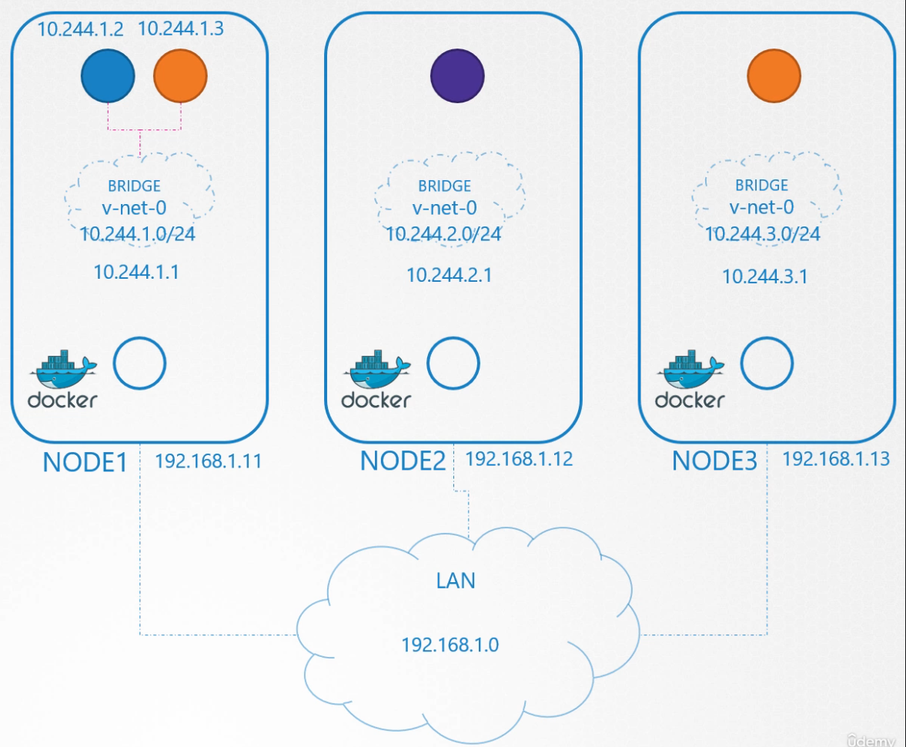
1. sur chaque node (ou host), on crée une iface de type bridge
2. chaque namespace (ou pod) doivent etre linké au bridge avec des veth (cable virtuel)
3. chaque namespace doit obtenir une ip sur son iface co au veth/bridge
4. on ajoute une route pour ajouter une default gateway (utile pour la suite)
5. on active (set UP) l'iface
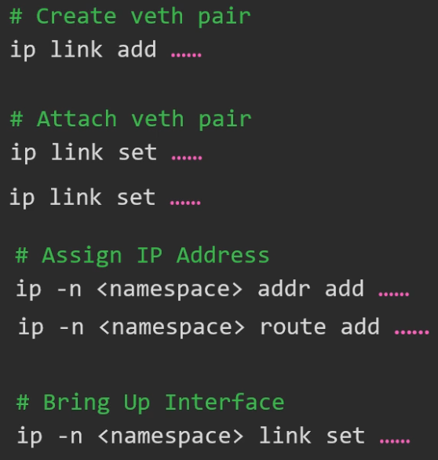

À ce niveau les pods d'un meme node peuvent se parler. Si on ajoute des routes au niveau de chaque node (host), pour déclarer l'existance des virtual privates networks des autres nodes, ça fonctionne : `ip route add <ip network of node N> via <internal ip of node N>`. Sinon on le gère via un router et dans sa table de routing, ce qui permet de rassembler tous les privates networks de chaque node du cluster dans un seul et meme réseau
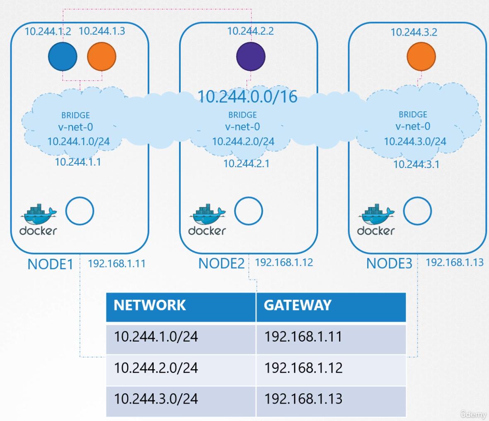

Kube peut s'occuper de run notre script sh quand il faut si on le modifie légèrement pour qu'il implém la CNI : en gros il faut faire apparaitre des section ADD) et DEL) qui seront appelé automatiquement par kubelet à la création ou la suppression d'un pod (kubelet utilise les directories qu'on lui passe en option dans sa commande)
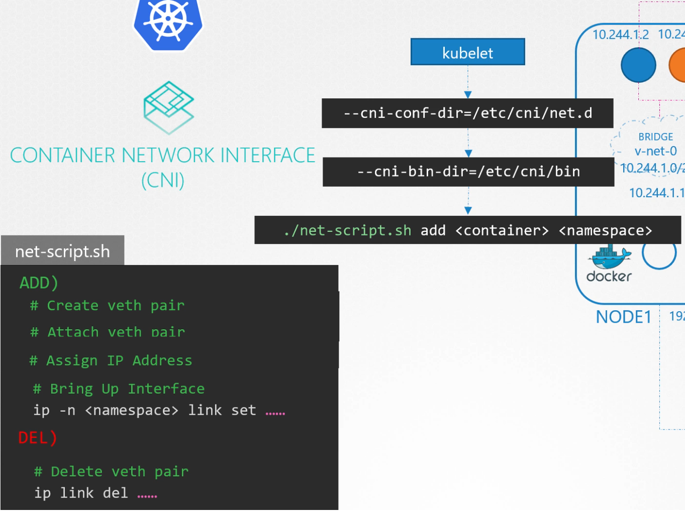

En prod, en gal on se fait pas chier à faire le script nous-meme. On peut passer le plugin que l'on veut utilisé via l'option --network-plugin de la commande kubelet. Le plugin implem la CNI du coup kubelet utilisera ses scripts et basta. 
Rq : il faut aussi passer le dir des différents binaires du cni via l'option `--cni-bin-dir` et les conf via `--cni-conf-dir`

Dans cette conf, on déclare notamment la solution à utiliser pour IPAM (IP addr management) qui permet de garantir que chaque IP est unique tout node confondu.

### plugin ex: Weave

Un plugin (comme weaveworks p ex) fonctionne en placant des agents (daemonset) sur chaque node qui va créer le bridge et surveiller les mouvements des pods. lorsqu'un paquet http est envoyé par un pod, le paquet est intercepté par l'agent. il va l'encapsuler dans un nouveau paquet qu'il transmettra au bon agent (sur le node de dest). Weave s'installe facilement via kubeadm au moment de la création du cluster ou en une seule ligne de commande si le cluster est deja existant. Une fois installé, on peut retrouver les deamonsets avec k get pods sur le ns kube-system et pour debug on peut retrouver les logs comme n'importe quel autre pod.

### Service networking

Pour rappel, en pratique on crée des service (clusterIP, nodePort, ...) pour exposer nos pods. En réalité ces services sont des règles dans les routing tables des nodes. C'est pour ça qu'on ne peut pas trouver de process associé null part. Au meme titre que kubelet pour les pods, c'est kube-proxy qui s'occupe de créer/supprimer les services. On peut spécifier la lib qu'il doit utiliser (p ex iptables)

#### exemple de creation d'un service clusterIP pour attribuer une IP à un pod

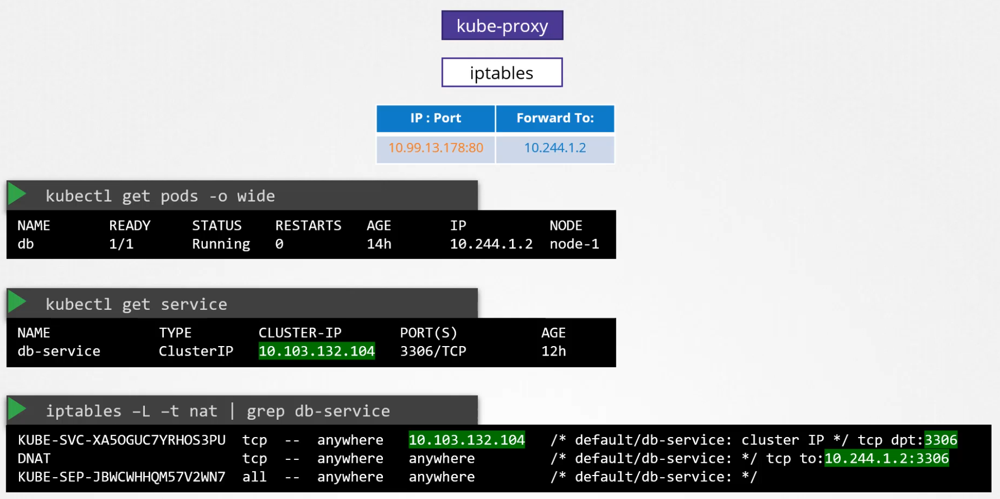

On peut aussi debug ça dans les logs de kube-proxy, en gal dans le dossier `/var/log/kube-proxy.log` (faire aussi attention à la verbosité)

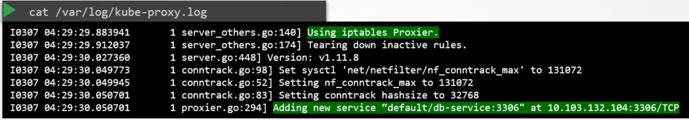

### DNS

à chaque fois qu'un service est créé, kube-dns ajoute une entrée DNS

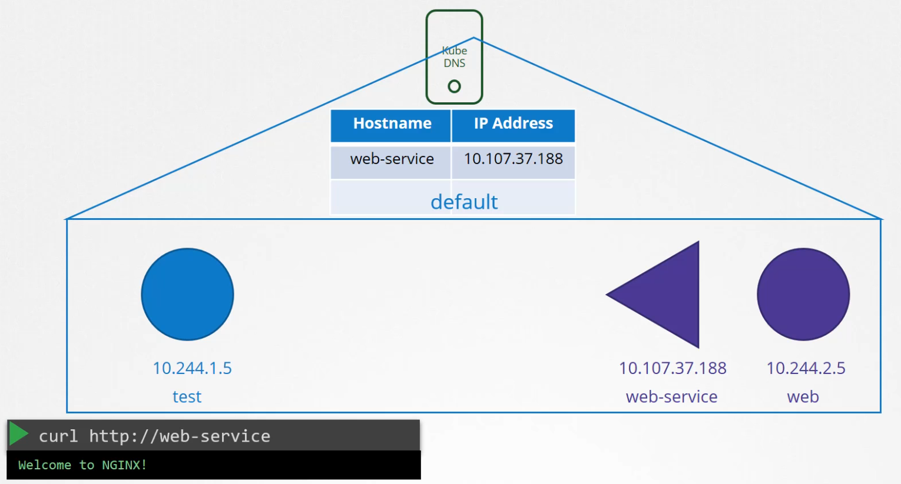
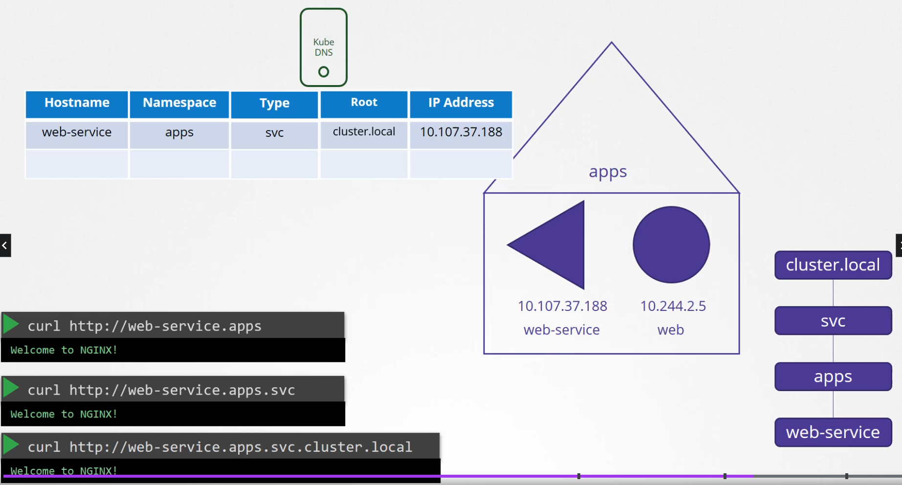

Coté pods, on peut conf kube pour qu'un record soit ajouté à chaque fois qu'un pod est créé. Par contre il n'utilise pas de hostname, il utilise à la place son addr ip.

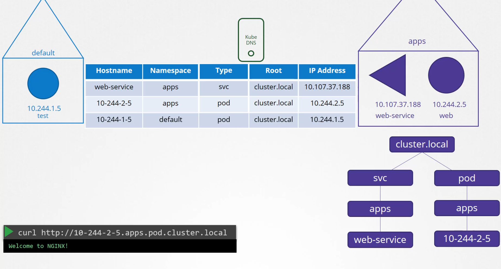

Kube utilise coreDNS par def pour gérer et centraliser la résolution des nom de domaines. Du coup on peut retrouver la conf dans `/etc/coredns/Corefile` (c'est ici qu'on peut conf kube pour créer un record à chaque création de pod) et c'est également chargé via une configMap (`k get configMap | grep coredns`). Lorsqu'un pod est créé, on lui déclare l'IP du serveur DNS dans /etc/resolv.conf ainsi qu'une entrée de type search de manière à gérer le nom de domaine cluster.local (c'est pour ça qu'on peut ensuite utiliser des raccourcis dans les hostnames)

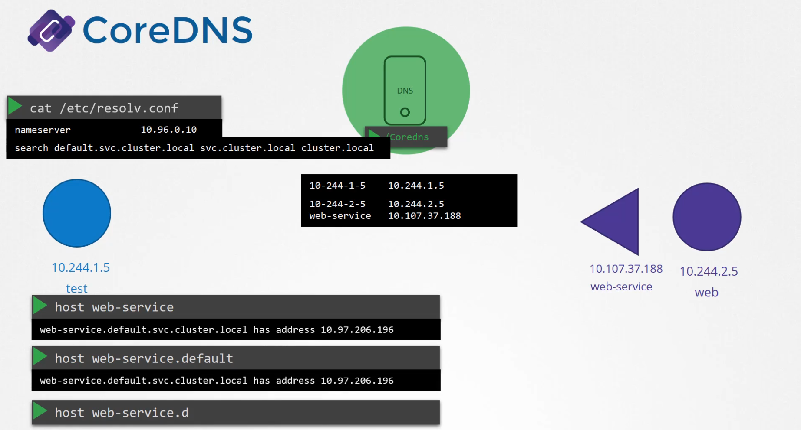

### Ingress

Une pratique courante consiste à déployer un reverse proxy (NGINX, HAProxy, traefik) pour gérer la load balancing en entrée du cluster : c'est ce qu'on appelle un Ingress Controller. Cela permet de gérer le LB de nos services avec kube au lieu d'avoir un LB à gérer en plus en dehors. En pratique au début on se dit qu'on n'en a pas besoin et avec le temps la complexité augmente et on finit par se dire qu'on aurait dû le faire dès le début.

Pour cela, le registry kube offre des images docker clé en main, p ex `quay.io/kubernetes-ingress-controller/nginx-ingress-controller` pour une image NGINX

À noter qu'un ingress-controller doit être exposer en sortie du cluster donc via un service nodePort ou LoadBalancer tout comme n'importe quel pod. La diff c'est qu'on utilise qu'un seul ingress-controller par cluster. L'autre benefice c'est que la conf Securité & Fwd ou Rewrites rules etc peuvent être géré dans nos def files kube plutot que d'avoir à gérer ça dehors.

Kubernetes propose de split les responsabilités dans des def files distincts :
* ingress controller = l'image que l'on va déployer e.g. nginx, haproxy via un `kind: Deployment`
* ingress ressources = les règles de LB que l'on veut implem sur ce reverse proxy

En pratique la conf de nginx (ou autre revewrse proxy) est gérée via des configMaps montées sur le pod.

Enfin, l'ingress controller ayant des responsabilités en terme de sécurité, en pratique on a besoin de lui attribuer un `kind: ServiceAccount` dédié afin de lui occroyer les permissions nécessaire pour fonctionner.

Les ingress resources c'est de la conf. On utilise un def file `kind: Ingress`. Coté spec le min c'est de déclarer le `backend:` en spécifiant le nom du service destinataire et son port. `k get ingress` pour visualiser. On les utilise pour créer des règles de routing basées sur l'URL. Le def file prévoit aussi un default backend au cas où le path de la requete ne match avec aucune des regles déclarées dans le def file

ex de commandes :
* `kubectl create ingress <ingress-name> --rule="host/path=service:port"`
* `kubectl create ingress ingress-test --rule="wear.my-online-store.com/wear*=wear-service:80" --dry-run=client -o yaml > ingress.yaml`

ex d'une regle de rewrite utilisant une expr reguliere `replace("/something(/|$)(.*)", "/$2")`
```yaml
apiVersion: extensions/v1beta1
kind: Ingress
metadata:
  annotations:
    nginx.ingress.kubernetes.io/rewrite-target: /$2
  name: rewrite
  namespace: default
spec:
  rules:
  - host: rewrite.bar.com
    http:
      paths:
      - backend:
          serviceName: http-svc
          servicePort: 80
        path: /something(/|$)(.*)
```
