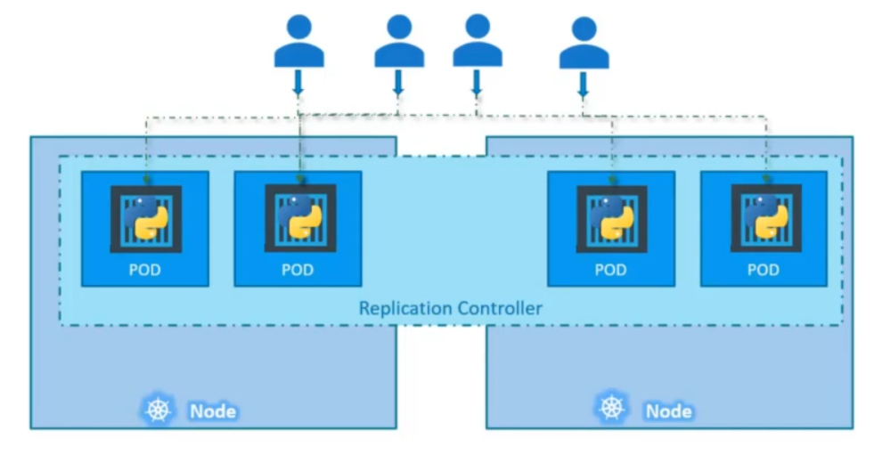
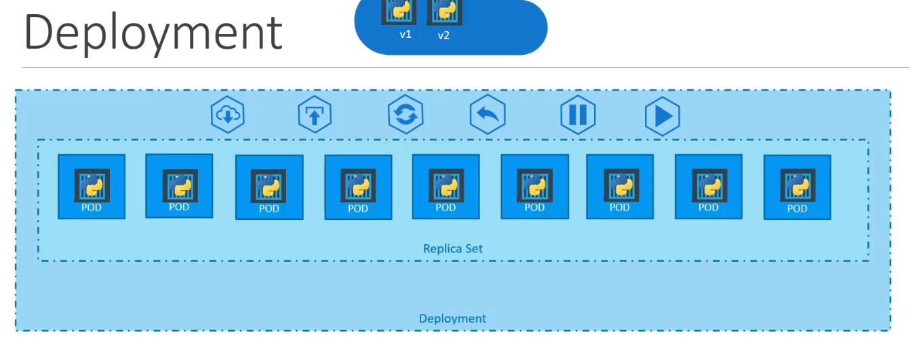
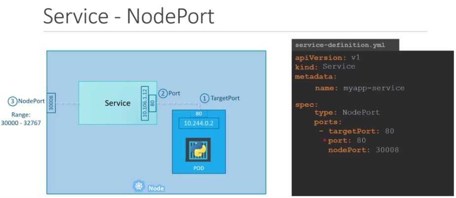

-------------------------
-------------------------
# Practices

## Pods' philosophy

Il faut les envisager comme des resources _scalables_ et _monitorables_. Il faut aussi considérer la sécurité et le networking. C'est via ces critères que l'on choisit les conteneurs que l'on veut regrouper dans un pod ou pas. 

Ex 1 : si 2 processes doivent scale up en meme temps genre 1 conteneurs applicatif avec un conteneur de monitoring alors on va mettre ces 2 conteneurs dans un pod. 

Ex 2 : si 2 conteneurs partagent les meme règles de sécurité ou bien qu'ils doivent accéder à un service avec la même identité, alors il faut envisager des les déployer dans le meme pod.

## Cheatsheets

### YAML definitions files

4 clés sont à la racine : 
* `apiVersion`, `kind` >> ces 2 là sont assez vite vus car il y a pas 300 solutions (cf. screen) 


* `metadata` >> où l'on peut annoter des choses concernant le pod, notamment la clé `labels` qui permet en général de distinguer les pods sur le cluster (le choix des clés est libre pour tout ce qui se trouve dans les labels)
* `spec` >> c'est là que tout va se jouer. À noter que les clés possibles dans cette partie sont différentes selon ce qu'on a choisi de déployer i.e. ce qu'on a mis dans `apiVersion`, `kind`
  * `containers` est une liste car on peut avoir plusieurs containers dans un pod. C'est ici qu'on va renseigner l'image docker sur le registry docker hub (on peut utiliser un autre regitry bien sûr, dans ce cas il faut mettre l'url en entier)

## CLI commands

* pour créer un pod sans passer par un controller
```sh
kubectl run pod-name -i <image-name>
```

* Pour appliquer un _def file_
```sh
kubectl create -f <path-to-yaml>
```
ou
```sh
kubectl apply -f <path-to-yaml>
```
qui fonctionne tout le temps i.e. pour la creation ou l'édition

* pour générer un def file facilement
```sh
kubectl run redis --image=redis123 --dry-run=client -o yaml > redis-pod.yaml
```

* pour generer un conf file de type Deployment p ex 
```sh
kubectl run --generator=deployment/v1beta1 nginx --image=nginx --dry-run --replicas=4 -o yaml > nginx-deployment.yaml
```

* si on est ssh sur le master node, on peut toujours se ssh sur un worker node via l'ip interne de kube i.e. celle qui commence par `10.*`


# Controllers

## Replica Set (ou Replication controller - legacy)

Utile pour avoir une HA, pour du LB et du Scaling. À noter que ce controller peut agir au dela du scope d'un node worker



Dans le def file, il y a 2 clés importantes :
* `template` inclut un Pod definition file (à l'exception de apiVersion et kind)
* `replicas`

RQ : on peut interroger le cluster kube pour connaitre les replicaset via la command `kubectl get replicas<tab>`

Pour les replicasets, c'est comme les replica controllers mais l'idée c'est de décorreler la conf avec celle des pods via la clé `selectors` en utilisant matchLabels p ex

les command lines : `kubectl replace -f <path-to-def-file>` en ayant update la conf au prealable. ou bien `kubectl scale` mais attention car on peut desynchro la conf avec celle dans le cluster. 

Question : à quelle moment est utilisé la clé `template` ? est ce que ca veut dire que les replicas peuvent différer de la definition du pod ? quel interet ?

à noter que lorsque l'on modifie le template des pods supervisés par un replicaset, il est parfois nécessaire de tuer les pods afin que la modification soit appliquée

## Deployment

C'est la partie qui nous permet de configurer comment vont se déployer nos pods.

RQ : une conf Deployment encapsule la ou les confs Replica Sets (cf. picture)




# Services

C'est une couche abstraite pour configurer la liaison vers les Pods. 

## Node Port

Si on veut faire une requete http sur un pod :


Attention : on voit donc qu'il s'agit d'exposer un groupe de pod via un port au niveau du ou des node workers que l'on configure via ce service. Cela n'ouvre pas un accès depuis l'extérieur, pour l'instant il est quand meme nécessaire de se trouver dans le même réseau que celui du node. Kube prévoit bien d'exposer nos pods vers l'exterieur mais il devra être hébergé dans un cloud provider supporté, auquel cas on peut utiliser la meme conf que le node port mais en créant un service type `LoadBalancer` à la place.

En réalité il existe 2 ports en plus qu'on ne voit pas dans le schema precedent, entre le pod et le service. 
Voici un ex de def file :



À noter que la clé `ports` est au pluriel et attend donc une liste. 

De la même maniere que pour les replica set, le service nodeport prévoit un clé `selector` de manière à identifier les pods qu'il doit servir via les labels du pod. 
Le scope du service NodePort est celui du cluster kube. Ça veut dire qu'avec ce genre de definition file, tous les pods même s'ils tournent sur différent `worker nodes` du cluster seront servi du moment que leurs labels match celui du service NodePort. L'algorythme utilisé par kube pour choisir un des pods matchant la selection est `random`. Ainsi, il existe _out-of-the-box_ un `load balancing` dans le Node Port kube (cf. screen ci dessous)


À noter que le service est dispo dans tous les node workers du cluster. Ainsi, meme si par malheur le node que l'on choisi n'héberge pas le pod désiré, il répondra quand meme correctement comme tous les autres nodes workers

## Cluster IP

On les utilise plutot pour de la communication entre POD. Il va associer un hostname à un group de pod selectionné via leurs labels à travers la clé `selector`


# Namespace

À noter que Kube crée 3 namespaces par défaut :
* `Default` : à ne pas utiliser en production
* `kube-system` : tous les objets utile à Kube lui meme pour faire fonctionner le cluster
* `kube-public` : pour les objets qui devraient être accessibles pour tout le monde

à noter qu'une entrée DNS est attribué par défaut a tous les services que l'on crée sous le format suivant : 
`<service-name>.<namespace>.svc.cluster.local`
`cluster.local` est le nom de domaine par défaut

Pour la création de resource kube, on peut soit spécifier `--namespace=` dans la command kubectl soit utiliser la clé `namespace:` dans le def file sous le noeud `metadata:`

On peut créer des namespaces via un def file ou via la command `kubectl create`

Les namespaces ont été prévu pour les environnements dev/preprod/staging/qa/prod car on peut allouer des limites pour chaque namespace via l'objet `ResourceQuota`, mais bon à priori utiliser des clusters différents c'est encore mieux isolé.

# Scheduling

## Manual conf

On peut associer les nodes manuellement dans le configuration file d'un pod via la clé `nodeName` (sous le noeud `spec`) qui est d'ailleurs utilisée en interne par le scheduler de kubernetes et créer ainsi uin nouveau pod en le forçant sur le node demandé. Si le pod est deja créé, kubernetes ne permettra plus de changement mais il est possible de passer par l'api http que le scheduler utilise i.e. `/pods/$PODNAME/binding` via une POST requete

## Taints and tolerations

Penser à l'analogie du repulsif d'insecte e.g. anti-moustique. Dans cette analogie, les differents types d'insectes sont les PODs d'un cluster dont on associe une _Tolerance_. La personne dont on associe un Taintest un node dont on associe un _Taint_. C'est une maniere d'éviter que certains node soient selectionnés par le scheduler kube dans le deploiement de PODs.

à savoir qu'on peut specifier 3 types de comportement pour le Scheduler s'appuyant sur le lifecycle des PODs kube : 
* NoSchedule (pas de nouveau pod)
* PreferNoSchedule
* NoExecute (le plus stricte des 3)

## NodeSelector

C'est un moyen de spécifier sur quel node (via ses labels) on veut déployer un pod

## NodeAffinity

C'est un NodeSelector ++. Il existe notamment plusieurs operator (e.g. NotIn en passant une liste de values, Exists qui teste l'existance de la clé uniquement, etc)
À noter qu'il existe des types de comportement NodeAffinity qui ressemblent à ceux de la feature _Taints&Tolerations_ que l'onspecifie via une longue clé requiredDuringSchedulingIgnoredDuringExecution etc

# Resources req and limits

Ces 2 infos sont utilisées par le scheduler pour choisir le node. S'il n'existe aucun node avec assez de resource, alors le POD reste en pending.

* `request` c'est le min alloué. Il peut etre configuré au niveau du namespace

Dans le monde de Docker, un conteneur peut utiliser autant de resource qu'il le veut. C'est pour à ce manque que kube prévoit de spécifier une `limit`
* `limit` c'est le max. Par def 1 cpu et 512Mi. 

Si le CPU dépasse la limit spécifié alors kube va **throttle** le container. Si la memoire depasse, le POD sera finalement _terminated_.

Conversion :
* 1 cpu = 1vCPU (AWS) = 1 core (GCP/Azure) = 1 Hyperthread
* 1 cpu = 1000m

/!\ Ca se regle pour **chaque** container dans un pod.
