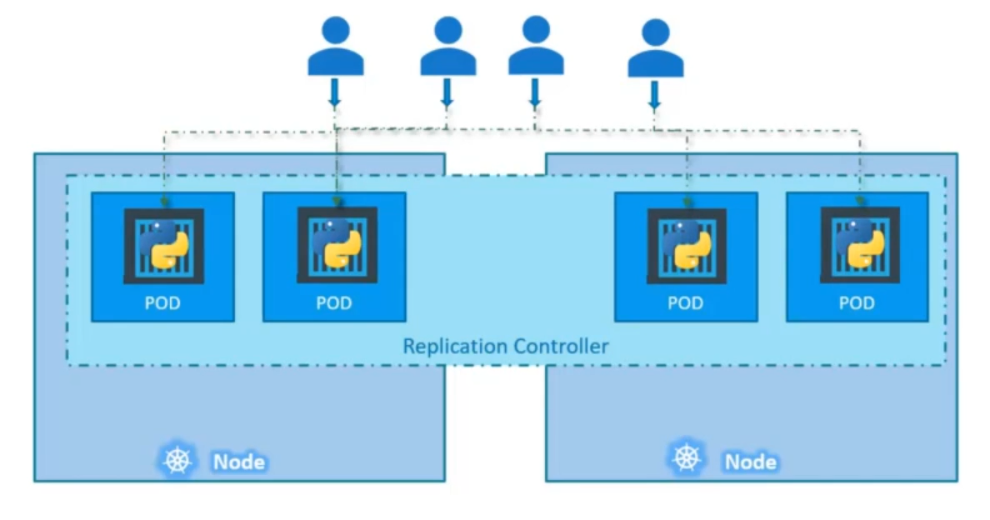
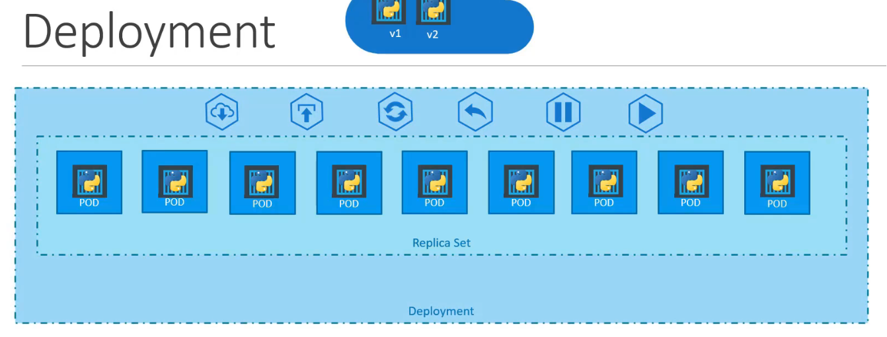
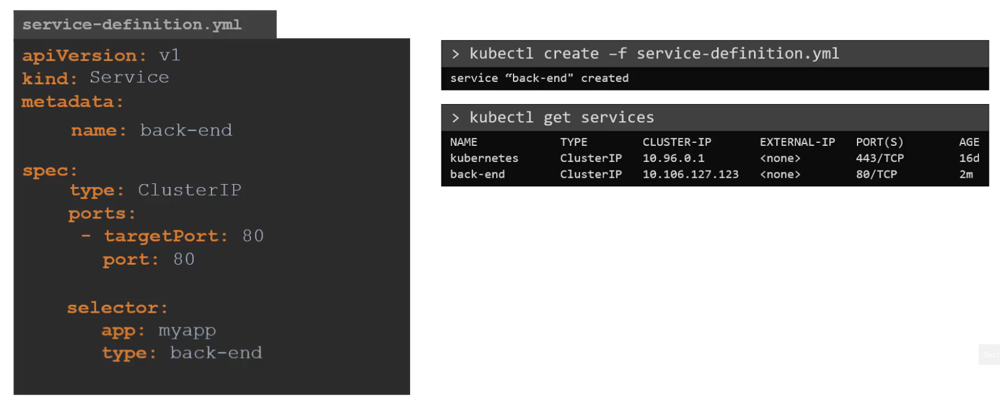
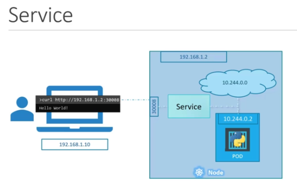
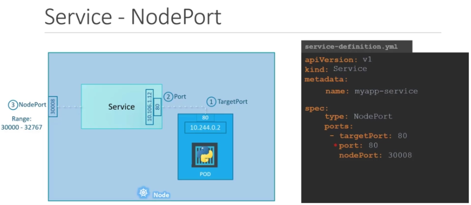
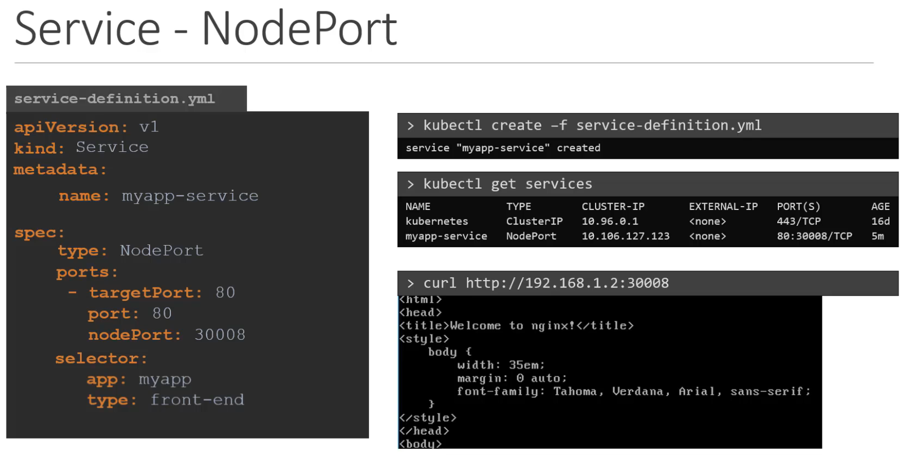
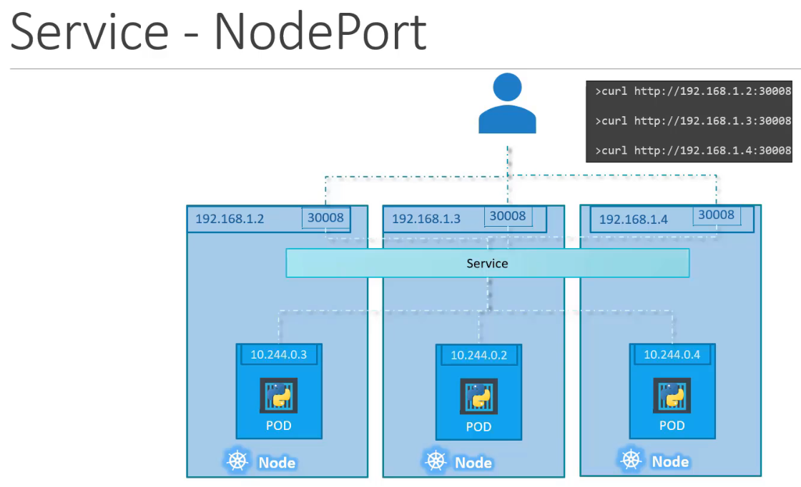

# Controllers

## Replica Set (ou Replication controller - legacy)

> Utile pour avoir une HA, pour du LB et du Scaling. 

> Il peut agir au dela du scope d'un node worker

Dans le def file, `template` inclut un Pod definition file.

Pour les replicasets, c'est comme les replica controllers mais l'idée c'est de décorreler la conf avec celle des pods via la clé `selectors` en utilisant `matchLabels` p ex

Question : à quelle moment est utilisé la clé `template` ? est ce que ca veut dire que les replicas peuvent différer de la definition du pod ? quel interet ?

à noter que lorsque l'on modifie le template des pods supervisés par un replicaset, il est parfois nécessaire de tuer les pods afin que la modification soit appliquée

## Deployment

> C'est la partie qui nous permet de configurer comment vont se déployer nos pods.

RQ : la conf Deployment "encapsule" la conf Replica Sets

## Daemon set

> il garantit qu'exactement 1 pod sera déployé sur chaque worker node. Utile pour les logs, le monitoring ou le networking en general.

Le def file ressemble à celui d'un replicaset.

P. ex. kube-proxy est de type daemon set

# Namespace

> C'est un scope pour les ressources kube (services + objets - i.e.pods&controllers) utilisé pour de l'**isolation**

À noter que Kube crée 3 namespaces par défaut :
* `Default` : à ne pas utiliser en production
* `kube-system` : tous les objets utile à Kube lui meme pour faire fonctionner le cluster
* `kube-public` : pour les objets qui devraient être accessibles pour tout le monde

À noter qu'une entrée DNS est attribué par défaut a tous les pods et service grace à kube-dns :
* dans le meme namespace, il suffit d'appeler le nom du service (p. ex. `mysql.connect(<service-name>)` ou bien HTTP request sur le host `<pod-internal-ip>` dans le namespace ou bien `<pod-internal-ip.<namespace>.pod.cluster.local>`)
* dans 2 namespaces différents, `<service-name>.<namespace>.svc.cluster.local`

CLI ex

Pour la création de resource kube, on peut soit spécifier `--namespace=` dans la command kubectl soit utiliser la clé `namespace:` dans le def file sous le noeud `metadata:`

On peut créer des namespaces via un def file ou via la command `kubectl create`

Pratique : environnements multiples & limites de ressources

Les namespaces ont été prévu pour les environnements dev/preprod/staging/qa/prod car on peut allouer des limites de resources par namespace via l'objet `ResourceQuota`. Mais en pratique c'est encore mieux isolé d'utiliser des clusters différents.

# Services

> C'est une couche abstraite pour configurer la liaison vers les Pods. 

Il n'y a pas de process qui tourne pour ça car kube gère ça en appliquant des règles de networking dans les nodes e.g. dns records ou table de routing (cf. [Networking](./networking.md))

## Cluster IP

> Utile pour exposer un pod via un hostname à du **trafic interne** au cluster pour les DBs p ex

Il s'appuie lui aussi sur les labels d'un pod à travers la clé `selector`

Ainsi, le pod est joignable via le nom du service ! p ex si j'ai un pod web-app et que je créé un service web-app-service de type clusterIP, alors les autres pods du cluster pourront appeler le pod via http://we-app-service

## Node Port

> Expose un (groupe de) pod sur un port donné à l'entrée du cluster (trafic externe). Peu utilisé en prod car il y a des limitations

  
Les limites :

  * ports 30000 à 32767 uniquement
  * si l'ip du node change c'est baisé

--

Il est nécessaire de préciser 3 ports pour cette conf : 

À noter que la clé `ports` est au pluriel et attend donc une liste. 

De la même maniere que pour les replica set, le service nodeport prévoit un clé `selector` de manière à identifier les pods qu'il doit servir via les labels du pod. Ainsi, tous les pods, même s'ils tournent sur différent `worker nodes`, seront servis par le service NodePort. L'algo pour choisir au "runtime" est `random`. Ainsi, il existe _out-of-the-box_ un `load balancing` dans le Node Port kube (cf. screen ci dessous)

À noter que le service est dispo dans tous les node workers du cluster. Ainsi, meme si par malheur le node que l'on choisi n'héberge pas le pod désiré, il répondra quand meme correctement comme tous les autres nodes workers

## LoadBalancer

> Si le cloud provider le supporte, il est possible d'utiliser cette conf pour mapper un nom de domaine pour un groupe de pod

On utilise la meme conf que le node port mais en créant un service type `LoadBalancer` à la place qui peut disposer d'une IP publique. On pointe notre nom de domaine vers cette IP et nos users peuvent accéder à nos pods.

Sous le capot, kubernetes utilise en fait un service NodePort mais en plus il va faire un appel à l'api de notre cloud provider pour provisioner un LoadBalancer configuré comme il faut pour taper sur le port directement (c'est ce qu'on devrait faire nous même si cette solution n'existait pas)

Il existe encore des limites :
* cette solution va créer un LB pour chaque service donc c'est pas gratuit si on souhaite exposer pleins d'applications
* en pratique si on a plusieurs app à exposer publiquement, on aura probablement besoin d'un nouveau LB pour gérer des règles de forwarding ou centraliser les règles de sécurité e.g. TLS/SSL, firewall rules, etc

Ainsi, sur des projets "ambitieux" on recommande en general de mettre en place un [Ingress Controller](./networking.md#ingress) dès le début.
