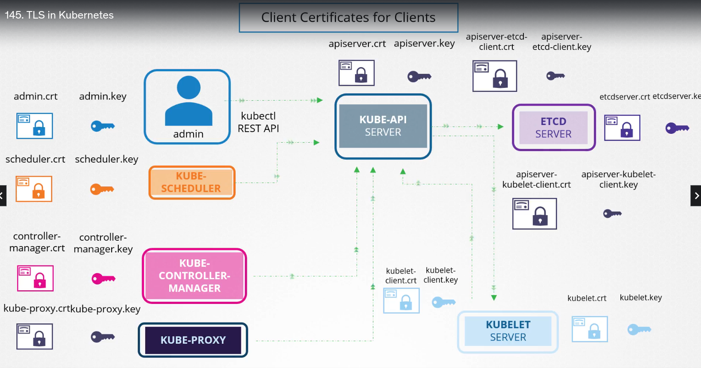
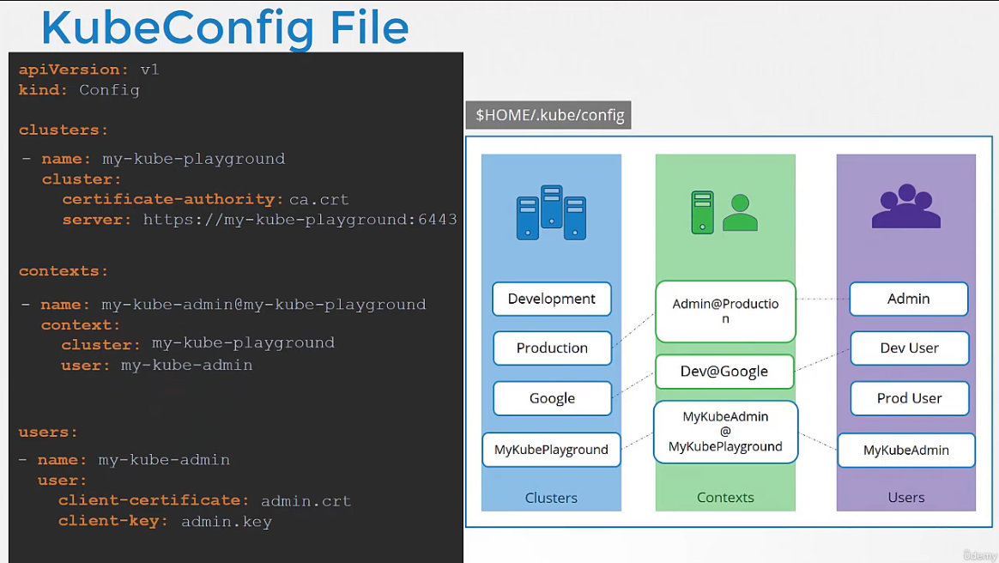

# Security

## ConfigMap & Secrets

* ConfigMap sert à stocker des variables d'env non sensibles pour nos applicatifs
* Secret c'est un ConfigMap mais "encodé"
  * il est heureusement possible d'encrypter mais pour ca on doit passer par un objet `kind: EncryptionConfiguration`
  * sous le capot, k8s stocke les variables en clair dans le ETCD store. Si on veut être secure, il faut configurer leur stockage sur un secret store (e.g. Vault, GCP secret, etc.), ou bien configurer [Encryption Data At REST](https://kubernetes.io/docs/tasks/administer-cluster/encrypt-data/?ref=blog.sighup.io) pour que la data soit stocké encryptée dans ETCD server
* On injecte ensuite ces variables 
  * une par une via la clé `env` 
  * ou bien en entier via la clé `envFrom` 
  * ou enfin via un/des fichier(s) monté(s) grace à la clé `volume`
* Important de préciser que n'importe qui pouvant creer un pod/deployment dans le namespace peut accéder aux secrets. Il est possible de limiter ça via le [RBAC](https://kubernetes.io/docs/concepts/security/rbac-good-practices/)

En pratique on utilise le plus souvent `generic` : `k create secret generic -h` pour voir les options.

`kubectl get secret db-user-pass -o jsonpath='{.data}'` pour visualiser les data

### Docker private registries

C'est via la feature Secret que kube propose de gérer l'authentification vers le ou les registry docker privés qu'on voudrait utiliser. **C'est un secret de type "docker-registry"**. Une fois ce secret créé, on peut l'utiliser dans le def file d'une ressource.

## Securing K8s API

* Authentication = "who can access?"
  * user/pwd via fichier
  * user/toker via fichier
  * certificates
  * extarnel authentication provider (p. ex. LDAP)
  * service accounts (pour les machines)

Par def, tous les pods peuvent se "parler" donc il faut les restreindre. 

### via Fichier (attention tout ça n'est pas secure pcq les mdp se balandent un peu partout en clair)

on passe un fichier de conf via l'option `--basic-auth-file` au service `kube-apiserver`. 1 ligne = 1 user. Si la liste est mise à jour il faut relancer le service. Pour le fichier de user token, l'option c'est `--token-auth-file`.

### Rappel sur les certidicats TLS et PKI
* TLS = ca sert à encrypter ET à garantir que le serveur est bien celui qu'il dit qu'il est
* La diff entre le chiffrement symetrique et asymetrique c'est que en symetrique on utilise 1 clé seulement qui sert à encrypter et decrypter. En asymetrique, 1 clé (publique) sert à encrypter et une 2e (privée) sert à decrypter.
* On utilise les 2 types de chiffrement en pratique : 
  1. le serveur génère sa paire de clés asymetriques
  2. le client récupère la clé publique du serveur (c'est là qu'on utilise le certificat SSL/TLS)
  2. le client génére une clé symétrique
  3. le user partage sa clé symétrique au serveur en toute sécurité en la chiffrant grace à la clé publique du serveur
  4. le serveur possède alors la clé symétrique du user

#### Public Key Infrastructure
Le certificat SSL/TLS contient la clé publique du serveur et l'URL ou les URLs à certifier. Mais il contient surtout le nom du *issuer* du certificat qui est la plupart du temps un organisme reconnue publiquement (en tout cas sur le web publique). Ces organismes sont les "Certificate Authority (CA)". Enfin, pour s'assurer que le certificat transmis dans la réponse https est bien généré par un CA, on utilise ici encore une paire de clé asym. En effet, chaque certificat est **signé** grace à la clé privée du CA ! Les browsers possèdent directement les clé publiques de tous les CAs reconnus afin d'afficher et valider (ou invalider) le certificat.

/!\ Attention car il est possible de se tromper et d'encrypter avec une clé privée auquel cas, n'importe qui disposant de la clé publique pourra décrypter les données.

#### Convention
En général, quand on créé une paire de clé, elles ont le même nom mais seule la clé privée contient le mot key dedans : 
* Certificate (public key)
  * server.crt
  * server.pem
  * client.crt
  * client.pem
* private key
  * server.key
  * server-key.pem
  * client.key
  * client-key.pem

### TLS dans kubernetes

K8s utilise aussi PKI. Du coup, pour chaque communication, clients et serveurs utilisent (et génèrent chacun) une paire de clés asym : 
* apiserver, etcdserver et kubelet en tant que serveur
* kube-scheduler, kube-controller-manager, kube-proxy, 1 user admin ou bien encore kupe-apiserver et kubelet en tant que client

api server et kubelet étant à la fois client et serveur en fonction du context, il est possible d'utiliser 1 seule paire de clé ou d'en créer 1 pour chaque "relation"

Pour les users admin, la "clé publique" (autrement dit le CSR = Certificate Signin Request) doit contenir un group (un peu comme dans LDAP) que l'on passe lors de la génération du csr. Pour générer la paire de clé d'un admin il faut donc :
1. d'abord créer la clé privée `openssl genrsa -out admin.key 2048` 
2. ensuite créer le csr (non signé par le CA) `openssl req -new -key admin.key -subj "/CN=kube-admin/O=system:masters" -out admin.csr`
  * Quand il y a beaucoup d'info autour de l'identité d'un parti (comme p ex pour kube-apiserver qui discute avec tout le monde), openssl prévoit l'usage d'un fichier `.cnf` qu'on passe via l'option `--config`
3. et enfin **signer** le CSR pour obtenir le CRT `openssl x509 -req -in admin.csr -CA ca.crt -CAkey ca.key -out admin.crt`

Pour sécuriser une transac, 3 éléments sont nécessaires de chaque côté (client ou serveur) : 
* une clé privée asym
* une clé publique signée par un CA
* la clé publique du CA

Tous ces éléments sont passés dans les différents services (pod static) via des options spécifiques pour chaque élément.

L'outil kubeadm génère tous les certificats mais si on installe kube à la mano alors il faut tout faire.

Pour afficher le contenu d'un certif openssl, on utilise la commande `openssl x509 -in <path du certif> -text -noout`. Les infos importantes sont : `Subject`, `Subject Alternative Name`, `Issuer` et `Validity`

### Certificates API

On a pu voir que c'était relou de générer des paires de clés pour chaque nouvel admin. Pour simplifier le process, kubernetes expose une api. Ainsi, un nouvel admin peut faire la demande de signature de son CSR lui-meme. Un workflow permet ensuite à un admin existant de review, accepter ou refuser chaque demande. Les commandes :
* `k get csr` pour review les demandes
* `k certificate approve <NAME>` pour accepter
* `k get csr <NAME> -o yaml` pour enfin pouvoir récupérer le certificat (encodé en base64)

Le core component qui s'occupe de ça est le kuber-controller-manager. Si on inspect sa config on retrouve les 2 clés du CA.

### KubeConfig

C'est la conf local d'un user, utile pour que kubectl forge les requetes. Elle est dispo à `$HOME/.kube/config`. Elle contient tout ce qu'il faut pour parler à l'api server : l'url de l'api et les clés et certif pour sécuriser les appels. par def kubectl va regarder dans `$HOME/.kube/config` et c'est pour ça qu'on ne sait même pas que ça existe

Dans une config, on retrouve nos différents `users` d'un coté, les `clusters kube` de l'autre. C'est la notion de `context` qui va permettre de lier les 2 : `1 context = 1 user @ 1 cluster`. Le certificat du CA est stocké au niveau du cluster. Les "clés" sont stockées au niveau du user

### Authorization Modes

Node
C'est la couche d'authorization utilisée par les kubelet des worker nodes. Elle s'appuie sur les infos (e.g. `Subject`) décrit dans le CRT

ABAC
Attribute Based Access Control permet d'associer un user ou une groupe de user à des permissions. Le probleme c'est qu'à chaque modif dans cette conf il est nécessaire de restart kube-apiserver.

RBAC
Role Base Access Control permet d'associer les permissions à un ROLE. Le user ou le groupe de user qui appartient alors à un Role se voit associer les memes permissions

Webhook
On peut config kube-apiserver pour appeler un webhook qui va gérer la couche d'authorization

AlwaysAllow
C'est le mode par défaut. Il authorise tout.

AllwaysDeny
Il interdit tout

On configure ça au niveau du pod kube-apiserver via l'option `--authorization-mode`. On peut en lister plusieurs avec des virgules auquel cas, il est lancera un par un dans l'ordre tant que l'accès est refusé (il s'arrete dès que l'un d'entre eux authorise l'acces)

### RBAC

C'est le mode standard en production

On passe par l'api pour créer un objet `kind:Role` et l'associer à des permissions.
Pour chaque user, on doit ensuite créer un objet `kind:RoleBinding` pour associer le user à un role.

Ces objets entrent dans le scope d'un namespace. Puisque les ressources hardware (comme les nodes) ne sont pas des ressources scopées dans un namespace, kube prévoit des objets `ClusterRole` et `ClusterRoleBinding` pour ça.

l'api ainsi que kubectl expose des outils pour ça.

### Service Accounts

On crée d'abord un SA, ensuite on peut générer un token jwt qui peut être utilisé via le header Authorization de l'api kube.

Par def, un token est généré par namespace. Par def, kube injecte (*mount*) ce token dans toutes les ressources d'un namespace. On peut injecter le token qu'on veut via le noeud `serviceAccountName:` dans le def file d'une ressource.

### Rappels de sécurité Docker

* un conteneur tourne via le meme noyau que son host (il n'est donc pas isolé comme un VM classique)
* quand on lance un conteneur, on peut voir le process dans le conteneur avec le PID 1, mais aussi dans le host avec un autre PID. La raison c'est que Docker utilise un système de namespace. le namespace du conteneur est inclut dans celui du host.
* par défaut, docker utilise le user root. Mais docker utilise une feature de linux qui permet de restreindre les permissions au niveau du host
* on peut ajouter des permissions ou en enlever via les option --cap-add ou --cap-drop dans la command docker run. Ainsi, le process dans le conteneur pourra faire plus de truc au niveau du host
* on peut utiliser un autre user que root si on veut via l'instruction USER du docker file ou bien --user de la commande docker run

Dans kubernetes, la même feature existe sans le node `SecurityContext:` d'un def file. ce noeud existe au niveau du POD ou au niveau du conteneur. Si on le place au niveau du pod alors il s'appliquera à tous les conteneurs de ce pod (sauf si on l'override au niveau du conteneur)

### NetworkPolicy (Trafic Policies)

Par defaut, tous les pods d'un cluster peuvent se parler.
On utilise un objet `kind: NetworkPolicy` pour inverser cette logique, cad que par def tous les pods associés à un networkPolicy ne pourront plus recevoir ni faire des appels http. 
On sélectionne les pods grace à leurs labels comme pour les ReplicationControllers via le noeud `podSelector:`. 
On peut ensuite ajouter des règles pour autoriser du traffic entrant (ingress) ou sortant (egress).
Ici encore on sélectionne la trafic via une clé `podSelector:`. Il faut peut etre aussi filtrer via le namespace grace au noeud `namespaceSelector:` quand le label ne suffit pas. Enfin, il existe aussi un moyen de "sélectionner"/autoriser via un range d'IP grace au noeud `ipBlock:`
